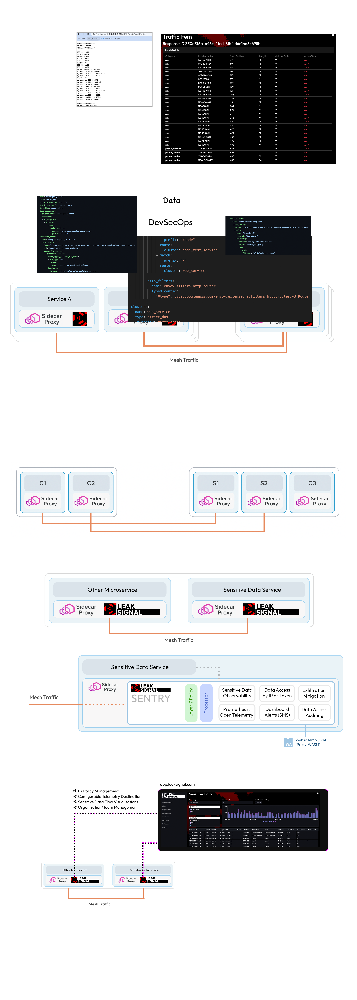

<a href="https://www.leaksignal.com"><p align="center">
  
</p></a>

<h4 align="center">
  <a href="https://www.leaksignal.com">Website</a> |
  <a href="https://blog.leaksignal.com">Blog</a> | 
  <a href="https://tinyurl.com/leaksignalslack">Slack</a>
</h4>

<p align="center">
  <a href="https://github.com/leaksignal/leaksignal/blob/master/LICENSE"></a>
</p>

<p align="center">🔍 There’s all kinds of sensitive data flowing through my services, but I don’t know which ones or what data. 🤷</p>

LeakSignal provides observability by generating metrics (or [statistics](https://www.envoyproxy.io/docs/envoy/latest/intro/arch_overview/observability/statistics#arch-overview-statistics)) for sensitive data that is contained in request/response content. LeakSignal metrics can be consumed by Prometheus, pushed as OpenTelemetry, or collected in a centralized dashboard.

### Features
* Fast, inline Layer 7 request/response analysis.
* Easy to configure rules ("L7 policy") for detecting and analyzing sensitive data (e.g. PII) leakage.
  * Detect part numbers, account numbers, patient info, grades, dates, email addresses, large arrays, etc. The available <a href="somewhere">ruleset</a> is constantly evolving.
* Cloud dashboard with policy editor, monitoring, and alerting.
* Analysis metrics can be exposed via Envoy and thus reflected wherever Envoy metrics are configured to land (OpenTelemetry, Prometheus, etc.)

### Installation

LeakSignal installs in moments as a WASM filter for Envoy, Istio, or any proxy/API gateway that supports Proxy-WASM. See Getting Started below.

### Overview
LeakSignal detects sensitive data within mesh traffic. Analysis and processing of traffic is handled inline, allowing engineers to understand sensitive data leaks without sending, storing or viewing the sensitive data.
<p align="center">
  
</p>

### LeakSignal SENTRY
LeakSignal establishes a framework and delivery mechanism for composable traffic analysis functions within a WASM VM. Sentry is the bytecode that allows for sensitive data analysis across request and response traffic in real-time.
<p align="center">
  
</p>
The following functionality can be enabled through the Layer7 Policy:

* Sensitive Data Observability
* Data Access by IP or Token
* Exfiltration Mitigation
* Data Access Auditing
* Prometheus and OTEL metrics
* Dashboard visualization (histogram, heatmap) and alerting via SMS or email

### LeakSignal COMMAND
LeakSignal Command (the cloud dashboard) provides visibility of data types and sends you SMS or email alerts when abnormal or unauthorized data access occurs.
<p align="center">
  
</p>

### Implementation
Built with Rust and deployed as WebAssembly, LeakSignal natively runs on proxies and API Gateways supporting [Proxy-WASM](https://github.com/proxy-wasm/spec). The current implementation is tested with Envoy, which is the underlying data management plane in most service mesh offerings.

LeakSignal analysis can be setup in the following modes:
* All metrics and configuration stay local in your environment
* All metrics and configuration go to LeakSignal COMMAND.
  * Sensitive data is sent to COMMAND by default.
  * Specific endpoints, match rules, or the entire policy can opt-in to send raw sensitive data, low-bit subsets of SHA-256 hashes for low-entropy data (i.e. credit cards, phone numbers), or no representation of the matched data at all.

## Getting Started with a Demo

If you're looking to kick the tires with a demo setup, you have 2 options:
1. [Simple Envoy Ingress controller for K8s cluster](https://github.com/leaksignal/testing-environments).
    * LeakSignal is preinstalled with policy and test applications/services. 
2. [Google's Online Boutique microservices demo for Istio](https://github.com/leaksignal/testing-environments/istio).
    * Follow along with the Istio install and then add LeaskSignal.
  
## Getting Started with Existing Setup 
If you already have an environment up and running (Standalone Envoy, K8s, or Istio) where you'd like to install LeakSignal, use the following quick starts.

### Envoy Quickstart
Docker commands to run an Envoy proxy with LeakSignal installed. 

1. [Register for an account](https://app.leaksignal.com/register)
2. Get your API key by clicking "Deployments" in the left hand navigation.
3. Create a simple barebones deployment by clicking "Create Deployment" on the Deployments page.
4. Replace YOUR-API-KEY and YOUR-DEPLOYMENT-NAME below with the values in LeakSignal Command.

```
FROM envoyproxy/envoy-dev:0b1c5aca39b8c2320501ce4b94fe34f2ad5808aa
RUN curl -O https://raw.githubusercontent.com/leaksignal/leaksignal/master/examples/envoy/envoy_command_remote_wasm.yaml > envoy_raw.yaml
RUN API_KEY="YOUR-API-KEY" DEPLOYMENT_NAME="YOUR-DEPLOYMENT-NAME" envsubst < envoy_raw.yaml > /etc/envoy.yaml
RUN chmod go+r /etc/envoy.yaml
CMD ["/usr/local/bin/envoy", "-c", "/etc/envoy.yaml"]
```
> * Go to Deployments -> YOUR-DEPLOYMENT-NAME and learn more about the L7 Policy that is currently running.
> * [View metrics in COMMAND](#view-metrics-command)


### Envoy-Local Quickstart (no cloud connection)
Docker commands to run an Envoy proxy with LeakSignal installed. 
* This configuration runs LeakSignal in "local" mode where metrics are only exported in the running Envoy instance. 
* The LeakSignal L7 Policy is contained in the Envoy yaml configuration. 
* LeakSignal API Key and deployment name are not needed.

```
FROM envoyproxy/envoy-dev:0b1c5aca39b8c2320501ce4b94fe34f2ad5808aa
RUN curl -O https://raw.githubusercontent.com/leaksignal/leaksignal/master/examples/envoy/envoy_local.yaml > /etc/envoy.yaml
RUN curl -O https://ingestion.app.leaksignal.com/s3/leakproxy/2022_10_16_16_18_40_fda6eb2/leakproxy.wasm > /lib/leaksignal.wasm
RUN chmod go+r /etc/envoy.yaml
CMD ["/usr/local/bin/envoy", "-c", "/etc/envoy.yaml"]
```

> * [Verify everything is setup correctly](#verify-proper-setup).
> * Test and configure L7 Policy for your environment
> * [View prometheus metrics in grafana](#view-metrics-prometheus--grafana)

Use the [test environment](https://github.com/leaksignal/testing-environments) to see a working example. Your sensitive data labels and counts will be exported as Envoy metrics. 


### Istio
Install LeakSignal across all Istio sidecar proxies with the following:

1. [Register for an account](https://app.leaksignal.com/register)
2. Get your API key by clicking "Deployments" in the left hand navigation.
3. Create a simple barebones deployment by clicking "Create Deployment" on the Deployments page.
4. Replace YOUR-API-KEY and YOUR-DEPLOYMENT-NAME below with the values in LeakSignal Command.

```
#set Istio to preview mode
istioctl install --set profile=preview

# Apply the following leaksignal.yaml to deploy the filter
API_KEY="YOUR-API-KEY" \
DEPLOYMENT_NAME="YOUR-DEPLOYMENT-NAME" \
curl https://raw.githubusercontent.com/leaksignal/leaksignal/master/examples/istio/leaksignal.yaml | \
envsubst | \
kubectl apply -f -

#restart all the pods
kubectl delete --all pod
```
> Go to Deployments -> YOUR-DEPLOYMENT-NAME and learn more about the L7 Policy that is currently running.

### Istio-Local (no cloud metrics)
Install LeakSignal across all Istio sidecar proxies with the following. 
* This configuration runs LeakSignal in "local" mode where metrics are only exported in the running Envoy instance. 
* The LeakSignal L7 Policy is contained in the Envoy yaml configuration. 
* LeakSignal API Key and deployment name are not needed.

A connection to the cloud is still necessary to pull the WASM proxy, but no metrics or sensitive data are uploaded.

```
#set Istio to preview mode
istioctl install --set profile=preview

# Apply the following leaksignal.yaml to deploy the filter
curl https://raw.githubusercontent.com/leaksignal/leaksignal/master/examples/istio/leaksignal_local.yaml | kubectl apply -f -

#restart all the pods
kubectl delete --all pod
```
> * [Verify everything is setup correctly](#verify-proper-setup).
> * Test and configure L7 Policy for your environment
> * [View prometheus metrics in grafana](#view-metrics-prometheus--grafana)

### Verify Proper Setup
After you've installed the LeakSignal filter, you can check the logs to see how things are running:

For Envoy standalone run:
```
tail -f /var/log/envoy.log
```
For Kubernetes run:
```
kubectl get pods
#find the envoy pod and use it below
kubectl logs -f [envoy podname]
```
For Istio run:
```
kubectl -n istio-system get pods
kubectl -n istio-system logs istio-ingressgateway-abc123
```
In all cases you should see messsages with "leaksignal" in the logs. Use those to understand if things are setup correctly. Note that you may see messages like `createWasm: failed to load (in progress) from https://ingestion.app...` if loading the wasm file remotely. This is a known issue and the wasm filter is functioning properly.  


### View Metrics (Prometheus & Grafana)
Prometheus is capable of ingesting LeakSignal metrics. You can configure your policy to alert on specific data types to detect spikes in emission of data or edge cases like the signature of a known RCE. (If you don't have or want to use Prometheus skip to the next step)

Here's an example from our [k8s test environment](https://github.com/leaksignal/testing-environments) where grafana displays LeakSignal metrics from prometheus:

LeakSignal defines 2 new metrics in Grafana:
1. Sensitive Data per Minute (SDPM)
2. Exploits per Minute (EPM)


### View Metrics (COMMAND)
Once you login to LeakSignal COMMAND, you'll see the Sensitive Data Overview as the default screen:

The following example data is from our k8s [test environment](https://github.com/leaksignal/testing-environments).


Scroll down to the data grid and click on a response ID to examine the alerts that were generated.


Click Heat Map in the left hand nav for a complete view of how sensitive data is accessed by IP addresses and/or authentication tokens


More docs coming soon!

### Test and configure L7 Policy
After you've verified that the filter is running, you can configure the policy to check for specific sensitive data types or patterns. For examples of preconfigured and performance tested policies, see [LeakSignal Policies](POLICY.md)

## Community / How to Contribute
* Code contribution guidelines (Coming soon)

## Commercial support
- Leaksignal, Inc offers support and self-hosted versions of the cloud dashboard. Contact sales@leaksignal.com.

## License 
Copyright 2022 LeakSignal, Inc.

Licensed under the Apache License, Version 2.0 (the "License");
you may not use this file except in compliance with the License.
You may obtain a copy of the License at

    http://www.apache.org/licenses/LICENSE-2.0

Unless required by applicable law or agreed to in writing, software
distributed under the License is distributed on an "AS IS" BASIS,
WITHOUT WARRANTIES OR CONDITIONS OF ANY KIND, either express or implied.
See the License for the specific language governing permissions and
limitations under the License.


